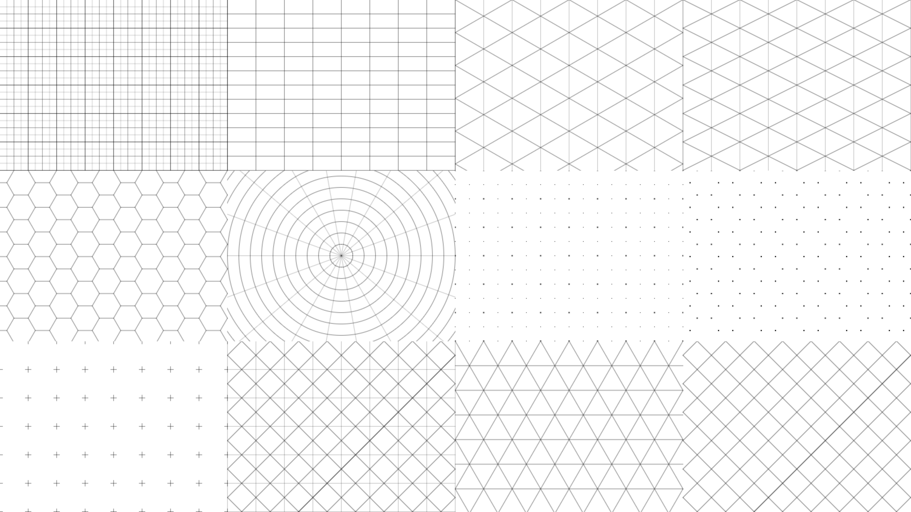

grid
====

A library for drawing various types of grids on HTML5's Canvas. Here are the functions available on the grid object. Each takes a context object to draw the grid to, x, y, w and h values to form a rect where the grid will be drawn, and other parameters that usually have to do with the resolution of the grid.

	square(context, x, y, w, h, majorRes, minorRes, thirdRes) // draws a square grid with three possible resolutions. Each resolution can have a different line weight and color

	rect(context, x, y, w, h, resx, resy) // draws a rectangular grid where each cell can have a different width and height.

	isometric(context, x, y, w, h, res) // an isometric grid. all angles are 60 degrees.
	
	dimetric(context, x, y, w, h, res) // a dimetric or "fake isometric" grid. there are 2 different angles, but the width of one "tile" is exactly twice the height.
	
	polar(context, x, y, w, h, res, degrees, cx, cy) // draws a polar or circular grid. you can specify the size of the concentric rings, the angle of each "slice" and the center x and y.
	
	hex(context, x, y, w, h, res) // draws a hexagonal grid.
	
	dots(context, x, y, w, h, majorRes, minorRes) // draws a square grid of dots. major and minor resolutions use different sized and colored dots.
	
	hexDots(context, x, y, w, h, res) // draws a hex grid using dots
	
	plus(context, x, y, w, h, plusSize, res) // draws a square grid using + symbols.
	
	triangle(context, x, y, w, h, res) // draws a grid of triangles.

	diamond(context, x, y, w, h, res) // draws a grid of diamonds.

	celtic(context, x, y, w, h, res) // draws a square grid overlayed with a diamond grid. useful for drawing celtic knot patterns.

Properties: These affect how the grid is drawn - line width, color, dot size. The major properties affect lines/dots drawn at the major resolution, minor affects the minor resolution, and third, the third resolution.

	majorLineWidth
	majorStrokeStyle
	majorDotSize
	majorFillStyle

	minorLineWidth
	minorStrokeStyle
	minorDotSize
	minorFillStyle

	thirdLineWidth
	thirdStrokeStyle

